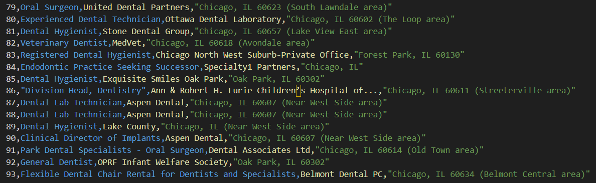

# Web Scrapping Dentist Jobs in Chicago

This directory consists of scripts that extract data from indeed and parse it to the csv file, named `d.csv`. After running the script, `d.csv` contained 93 entries. To reproduce data, it is required to install dependencies and supporting browsers (mentioned below). Afterwards, run `indeed_scraper_async.py`.

## Instal dependencies via pip

`pip install playwright bs4 pandas`

## Instal supporting browsers

`playwright install`

## Result

